# 2ο Γυμνάσιο Χανίων - 3oς Πανελλήνιος Διαγωνισμός Ανοιχτών Τεχνολογιών

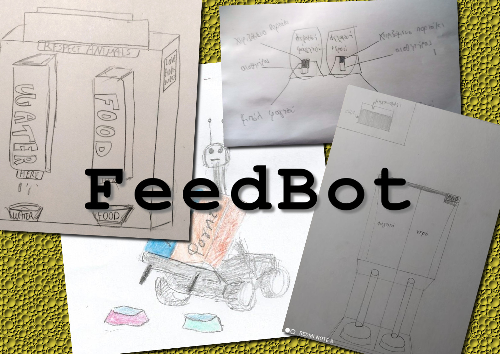

Η ομάδα ROBOTEAM του [2ου Γυμνάσιου Χανίων](http://2gym-chanion.chan.sch.gr) συμμετέχει στον 3o Πανελλήνιο Διαγωνισμό Ανοιχτών Τεχνολογιών, σχεδιάζοντας, προγραμματίζοντας και κατασκευάζοντας το πρωτότυπο ρομπότ **FeedBot**. Το FeedBot είναι ένα ρομπότ παροχής τροφής και νερού σε δεσποζόμενα και αδέσποτα ζώα.

Η ιστοσελίδα της ομάδας στο robotics.ellak βρίσκεται στην παρακάτω διεύθυνση:
- [https://openedtech.ellak.gr/robotics2021/2o-gimnasio-chanion-feedbot](https://openedtech.ellak.gr/robotics2021/2o-gimnasio-chanion-feedbot/)

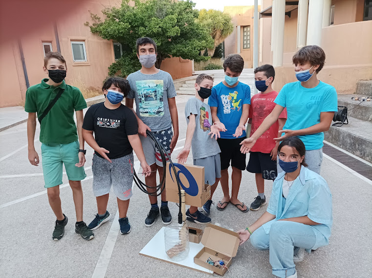

*Η ομάδα ROBOTEAM και το πρωτότυπο ρομπότ FeedBot*

## Έρευνα και σχεδίαση ##
### Μελέτη υπάρχουσας κατάστασης ###
 Στο πλαίσιο του πανελλήνιου διαγωνισμού ρομποτικής, η ομάδα του 2ου Γυμνασίου Χανίων  αποφάσισε να ασχοληθεί με το αυτόματο τάισμα των κατοικίδιων. Το ρομπότ μας, αποσκοπεί στην διευκόλυνση της καθημερινότητας των ιδιοκτητών κατοικίδιων ζώων αλλά και την παροχή νερού - φαγητού σε αδέσποτα ζώα. Για να μπορέσουμε να δημιουργήσουμε την βέλτιστη δυνατή εκδοχή της ιδέας μας, χρειάστηκε να μελετήσουμε την υπάρχουσα κατάσταση.
 Αναντίρρητα, ο πιο διαδεδομένος τρόπος για το τάισμα των κατοικίδιων αποτελεί η παροχή τροφής στο ζώο ανά τακτικά χρονικά διαστήματα.  Το ίδιο ισχύει και για την παροχή νερο.  Όσον αφορά τα σκεύη που χρησιμοποιούνται, η πλειοψηφία τους δεν έχει κανενός είδους αυτοματισμό. Αναφορικά με τις συσκευές που έχουν κάποιο αυτοματοποιημένο σύστημα, οι λειτουργίες τους είναι περιορισμένες. Τα προϊόντα αυτόματου ταΐσματος του εμπορίου, αφορούν κυρίως τους ανθρώπους με αναπηρίες, αλλά και οι ελάχιστες συσκευές που υπάρχουν για την παροχή τροφής σε ζώα, δεν είναι εύκολα προσβάσιμες για τον μέσο καταναλωτή.
 Επιπρόσθετα, η συσκευή μας στοχεύει και στο τάισμα αδέσποτων ζώων. Η υπάρχουσα μέριμνα του δήμου Χανίων, όσον αφορά τα αδέσποτα ζώα, περιορίζεται σε δοχεία νερού και φαγητού που έχουν τοποθετηθεί σε διάφορα σημεία της πόλης.  Η συγκεκριμένες ταΐστρες, στηρίζονται στην ανατροφοδότηση τους από ανθρώπους. Η αναγκαιότητα της μέριμνας των  ανθρώπων ως προς  την παροχή φαγητού σε ζώα, προκαλεί προβλήματα όσον αφορά την έλλειψη φαγητού για αρκετά μεγάλα χρονικά διαστήματα. Αν εξαιρέσουμε την μέριμνα του δήμου δεν υπάρχει άλλη αντίστοιχη δράση, εκτός από μεμονωμένες δράσεις ιδιωτών, οι οποίες δεν μπορούν να καλύψουν οργανωμένα τη γενικότερη ανάγκη των αδέσποτων ζώων.
 Συμπερασματικά, η παροχή φαγητού και νερού για τα κατοικίδια και τα αδέσποτα  έχει ως κοινό παρονομαστή, την προϋπόθεση την ανθρώπινης παρέμβασης. Σε αυτό πρέπει να συνυπολογιστεί και το γεγονός ότι οι οποίες αυτόματες ταΐστρες που κυκλοφορούν στο εμπόριο είναι αρκετά κοστοβόρες και όχι εύκολα διαθέσιμες στην Ελληνική αγορά.
 
 ### Ορισμός του προβλήματος ###
 Το πρόβλημα το οποίο σκοπεύει το FeedBot να αντιμετωπίσει χωρίζεται σε δύο τομείς, αυτόν των αδέσποτων και αυτόν των δεσποζόμενων ζώων.
 1. Στα αδέσποτα έχουμε το πρόβλημα του υποσιτισμού δηλαδή την μη επαρκή παροχή τροφής, νερού και κυρίως καθαρού νερού. Επιπλέον ένα επιπρόσθετο πρόβλημα είναι ότι υπάρχουν κυρίαρχα ζώα στους δρόμους τα οποία δεν επιτρέπουν στα υπόλοιπα ζώα σε ανάγκη να λάβουν το απαραίτητο φαγητό.
 2. Στα δεσποζόμενα τώρα ζώα έχουμε να αντιμετωπίσουμε ταυτόχρονα 2 προβλήματα: και της μη επαρκούς σίτισης σε περίπτωση απροσεξίας η απουσίας του ιδιοκτήτη αλλά και της υπερβολικής αίτησης η οποία είναι και αυτή εξίσου επικίνδυνη για το ζώο.

### Αναλυτική περιγραφή ιδέας ##
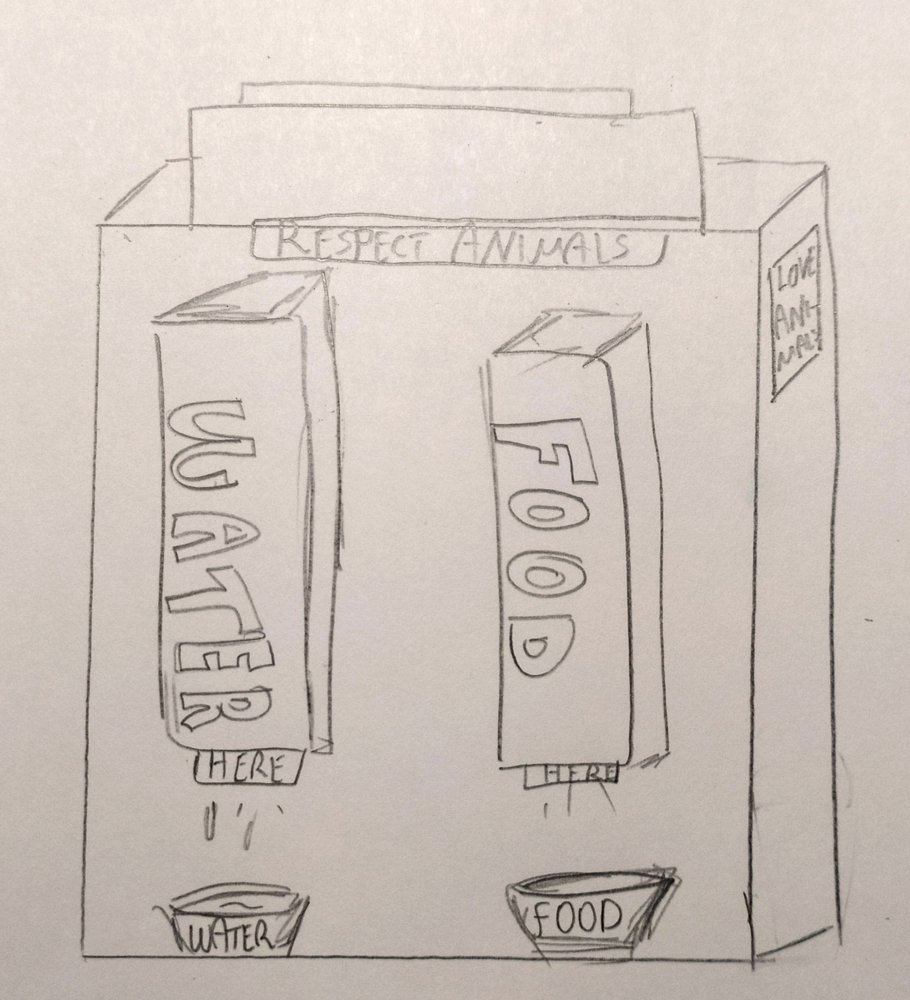

*Ένα από τα αρχικά σχέδια του ρομπότ*

Η ομάδα του σχολείου μας συγκέντρωσε συνολικά 12 [προτάσεις και ιδέες](schediasi/idees/idees.pdf) για τη συμμετοχή στον 3ο Πανελλήνιο Διαγωνισμό Ανοιχτών Τεχνολογιών στην Εκπαίδευση. Η ιδέα που τελικά επιλέχθηκε αφορά την σχεδίαση και κατασκευή του FeedBot, ενός ρομπότ που θα προσφέρει τροφή και νερό στα ζώα. Θα μπορούσε να λειτουργήσει για κατοικίδια ζώα σε εσωτερικό χώρο κάποιου σπιτιού, αλλά και σε δημόσιο χώρο για τις ανάγκες των αδέσποτων. Το ρομπότ θα εγκαθίσταται σε ένα, εύκολα προσβάσιμο για τα ζώα, χώρο και θα εξασφαλίζει την παροχή της προβλεπόμενης ή απαραίτητης ποσότητας τροφής και νερού για να εξυπηρετούνται τα ζώα που θα το πλησιάσουν και θα το χρησιμοποιήσουν. Κάποια αρχικά σχέδια για το πως φαντάζεται η ομάδα το ρομπότ feedBot είναι διαθέσιμα στο αποθετήριο της ομάδας, στη διεύθυνση:
- [https://github.com/2o-gymnasio-chania/2021_openedtech_competition/tree/main/schediasi/yliko](https://github.com/2o-gymnasio-chania/2021_openedtech_competition/tree/main/schediasi/yliko)

Στην περίπτωση της εγκατάστασής του σε εσωτερικό χώρο, για την εξυπηρέτηση κάποιου ή κάποιων κατοικίδιων, η παροχή νερού και τροφής θα είναι χρονοπρογραμματισμένη σύμφωνα με τις με τις ανάγκες των ζώων, ανάλογα με το είδος τους, τον αριθμό τους ή σύμφωνα με προδιαγραφές που θα ορίσει ο ιδιοκτήτης των κατοικίδιων. Στην περίπτωσή της εγκατάστασής του σε δημόσιο χώρο, το καθήκον του ρομπότ θα αλλάζει ώστε να διατηρεί το δοχείο του νερού γεμάτο, σε όλη τη διάρκεια του εικοσιτετράωρου. Το δοχείο της τροφής θα τροφοδοτείται με την ανάλογη ποσότητα κάθε φορά που κάποιο ζώο θα το πλησιάσει αρκετά. Όταν τα αποθέματα τροφής ή νερού είναι μικρότερα από τα όρια ασφαλείας που έχουν οριστεί, το ρομπότ θα προειδοποιεί για την ανανέωση των αποθεμάτων. Επίσης, θα ανιχνεύεται και θα καταγράφεται ο αριθμός των ζώων που εξυπηρετήθηκαν, ώστε να υπάρχει η δυνατότητα για στατιστική επεξεργασία της διαδικασίας.

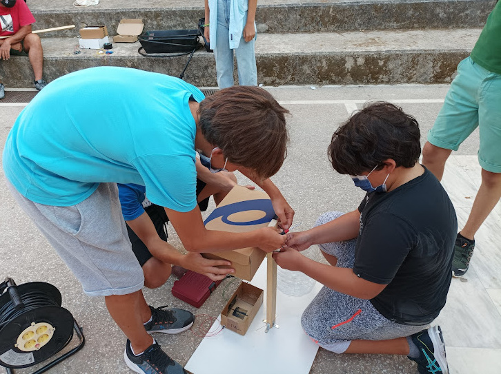

*Στιγμιότυπο από τη διαδικασία συναρμολόγησης του FeedBot.*

Η συλλογή και επεξεργασία των δεδομένων σύμφωνα με κανόνες για τη συχνότητα και την ποσότητα τροφής και νερού, η παρακολούθηση των αποθεμάτων και η καταγραφή της δραστηριότητας του ρομπότ συνθέτουν την **τεχνητή νοημοσύνη** του. Η ιδέα αυτή αποτελεί έναν πολύ εύκολο τρόπο για να ελέγχεται κάθε πότε δόθηκε φαγητό και νερό, σε τις ποσότητες και φυσικά το καλύτερο από όλα είναι ότι θα υπάρχει φροντίδα για τα κατοικίδια ακόμη και αν δεν είμαστε σπίτι.

Το ρομπότ αποτελείται από τα παρακάτω τμήματα:
1. ένα δοχείο για την αποθήκευση της τροφής,
2. ένα δοχείο για το τάισμα των ζώων,
3. μια ηλεκτρονικά ελεγχόμενη καταπακτή για τον έλεγχο της μεταφοράς τροφής από το δοχείο αποθήκευσης στο δοχείο ταΐσματος,
4. ένα λάστιχο ύδρευσης για τη σύνδεση του ρομπότ στο δίκτυο ύδρευσης,
5. ένα δοχείο για το πότισμα των ζώων,
6. μια ηλεκτροβαλβίδα για τον έλεγχο της ροής νερού από τη δεξαμενή στο δοχείο ποτίσματος,
7. δύο αισθητήρες για τον καθορισμό της ποσότητας της τροφής στο δοχείο ταΐσματος,
8. δύο αισθητήρες για τον καθορισμό της στάθμης του νερού στο δοχείο ποτίσματος,
9. ένα ρομποτικό ελεγκτή Arduino για τον έλεγχο και τον προγραμματισμό του ρομπότ και
10. υλικά κατασκευής και συναρμολόγησης.

Τα ηλεκτρονικά εξαρτήματα και το λογισμικό προγραμματισμού του που θα χρησιμοποιηθούν στο ρομπότ είναι ανοιχτής τεχνολογίας.

### Πρωτοτυπία λύσης ###
Μετά από  έρευνα που κάναμε στο διαδίκτυο συνειδητοποιήσαμε ότι δεν έχει ασχοληθεί κάποια ομάδα σοβαρά με αυτό το θέμα. Στην πόλη μας σπάνια μπορεί κανείς να συναντήσει τέτοιου είδους μηχανήματα καθώς ο περισσότερος πληθυσμός δεν νοιάζεται ιδιαίτερα γι’ αυτό το θέμα. Πιο συγκεκριμένα αυτό που θα φτιάξουμε θα είναι μια ταΐστρα ζώων, η οποία θα περιέχει δύο μπολάκια με τροφή για τα αδέσποτα της πόλης. Αυτό το μηχάνημα θα είναι προγραμματισμένο έτσι ώστε να παρέχει τροφή συγκεκριμένες ώρες της ημέρας αλλά και νερό για τα αδέσποτα. Το μπολάκι του νερού θα παραμένει γεμάτο κατά την διάρκεια όλης της ημέρας καθώς θα έχουμε προγραμματίσει το μηχάνημα να γεμίζει το δοχείο του νερού αμέσως μόλις καταναλώνεται από το αδέσποτο. Το μηχάνημα θα είναι τοποθετημένο σε ένα κεντρικό σημείο της πόλης  όπου εκεί υπάρχουν συνήθως αδέσποτα.
### Λίστα εξοπλισμού ##
- δοχείο νερού και κουτί τροφής (0€, αφού επαναχρησιμοποιήθηκαν υπάρχοντα δοχεία και κουτιά)
- [ηλεκτροβαλβίδα](https://www.hellasdigital.gr/electronics/components/solenoid-valve/12v-solenoid-valve-3-4-rob-10456/) για τον έλεγχο της ροής του νερού (10€)
- [γραμμικός ενεργοποιητής](https://grobotronics.com/solenoid-12v-jf-0826b.html) πηνίου για την μετακίνηση της καταπακτής της τροφής (8€)
- [ηλεκτρονόμος](https://grobotronics.com/relay-module-4-channel.html) για τον έλεγχο της ηλεκτροβαλβίδας και του γραμμικού ενεργοποιητή (6€)
- [αισθητήρας υπολογισμού της στάθμης](https://grobotronics.com/liquid-level-sensor.html) του νερού (3€)
- [φωτοαντιστάσεις](https://grobotronics.com/photo-resistor-ldr-5mm.html) για τον υπολογισμό της στάθμης της τροφής (0.4€)
- [ρομποτικός ελεγκτής Arduino Uno](https://grobotronics.com/arduino-uno-rev3.html) (22€)
- καλώδια διάφορων ειδών (10€)
- πλακέτες δοκιμών (10€)

### Ενδεικτικό κόστος ##
Εντός των παρενθέσεων στη λίστα προτεινόμενου εξοπλισμού αναφέρεται το ενδεικτικό κόστος για το κάθε εξάρτημα του ρομπότ. Το συνολικό κόστος περιορίστηκε στα **80 €**.

### Σχέδια ###
Στη φάση της σχεδίασης έγινε αναλυτική περιγραφή των χαρακτηριστικών που θα πρέπει να συγκεντρώνει το πρωτότυπο ρομπότ. Στη συνέχεια ανατέθηκε ως εργασία στα μέλη της ομάδας, να σχεδιαστεί το ρομπότ ή τμήματα και εξαρτήματα αυτού, σε ελεύθερο σχέδιο. Έτσι προέκυψαν τα παρακάτω σχέδια.

 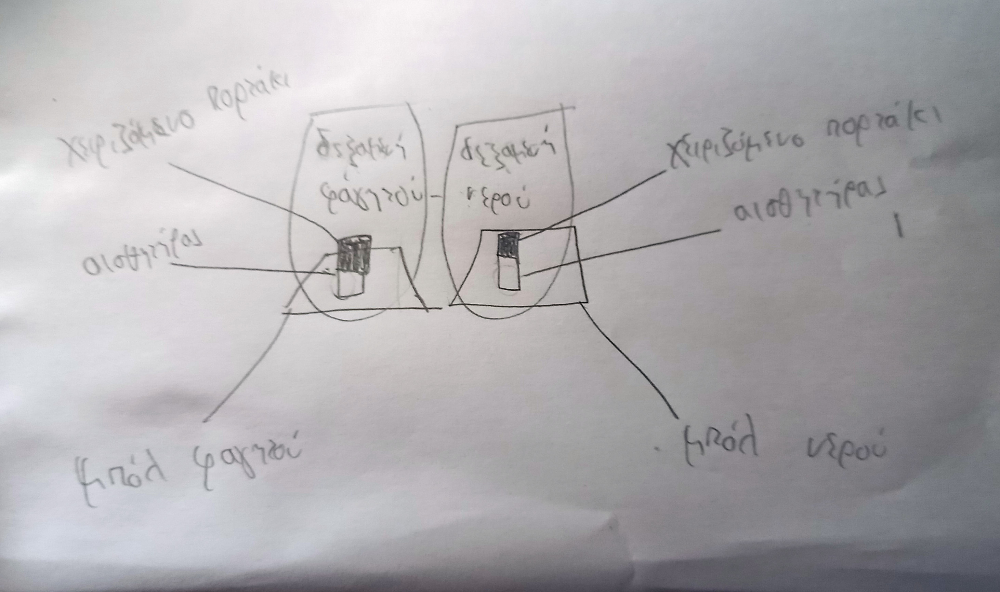

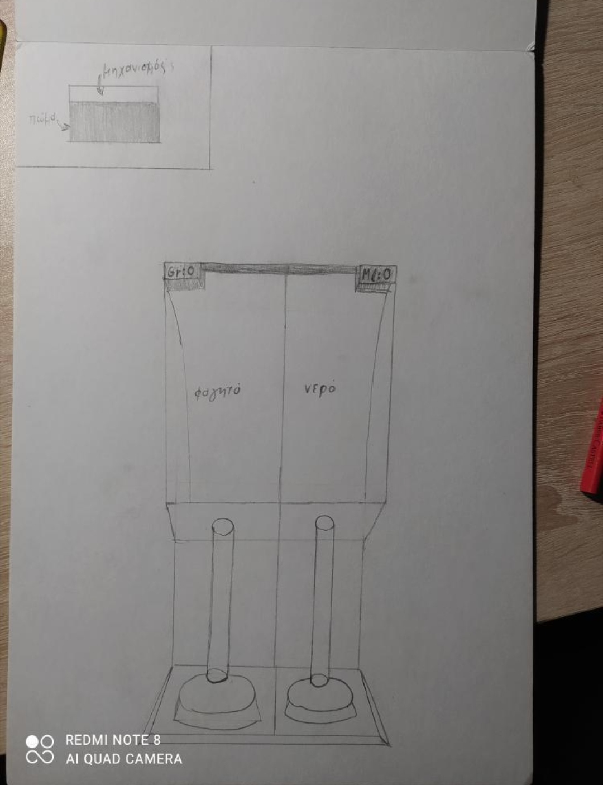  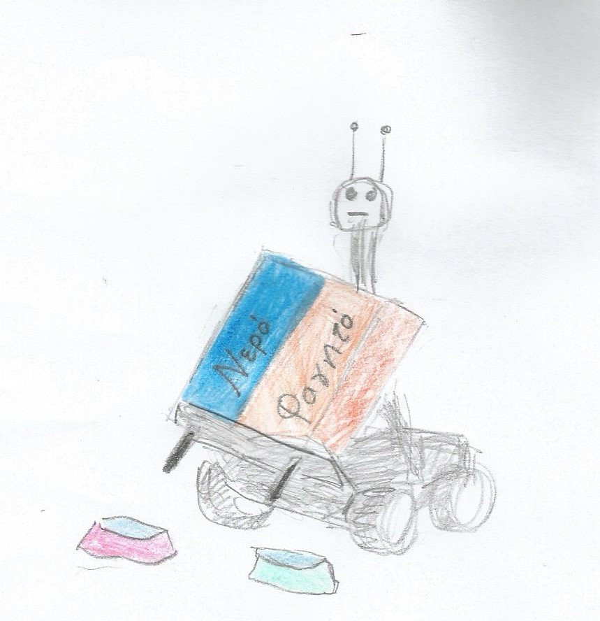

Μετά από προσεκτική μελέτη των προδιαγραφών του ρομπότ, ολοκληρώθηκε η σχεδίαση της παροχής τροφής και νερού, όπως περιγράφεται στα παρακάτω σχήματα.

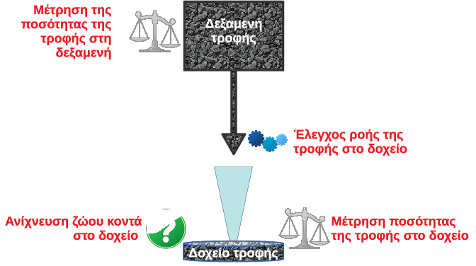

*Σχέδιο για την παροχή τροφής*

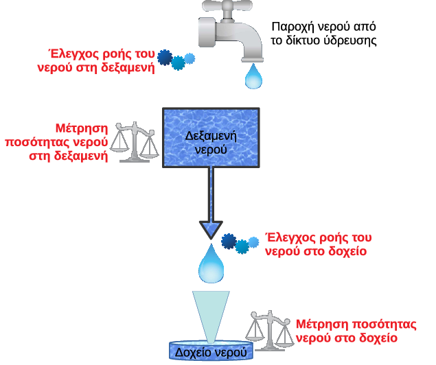

*Σχέδιο για την παροχή νερού*

### Βασικός αλγόριθμος ###
Ο βασικός αλγόριθμος που αναπτύχθηκε για το FeedBot είχε δύο τμήματα: το τμήμα για τη διαχείριση της τροφής και το τμήμα για τη διαχείριση του νερού. Οι αλγόριθμοι αναπαραστάθηκαν με τη μορφή flow charts και παρουσιάζονται παρακάτω.

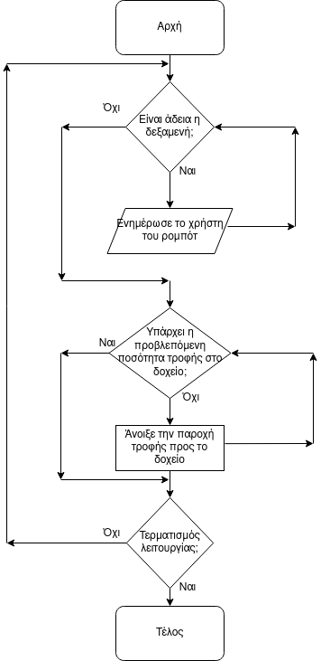

*Διάγραμμα ροής του αλγόριθμου που υλοποιεί την παροχή τροφής*

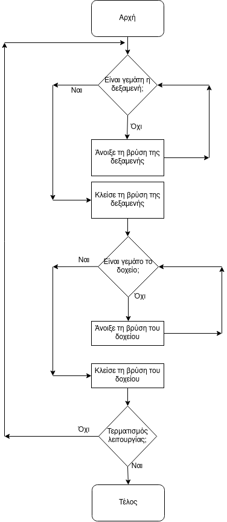 *

*Διάγραμμα ροής του αλγόριθμου που υλοποιεί την παροχή νερού*

## Υλοποίηση της ιδέας ##

*Στιγμιότυπο από τις εργασίες της ομάδας κατά την κατασκευή της βάσης του ρομπότ.*

### Προγραμματισμός ###
Ο προγραμματισμός έγινε για το ρομποτικό ελεγκτή Arduino Uno. Το πρόγραμμα που αναπτύχθηκε, σύμφωνα με τους παραπάνω αλγορίθμους είναι διαθέσιμο στο αποθετήριο, με το όνομα [test1.ino](schediasi/logismiko/programma_Arduino/test1/test1.ino).
### Μηχανισμοί και ηλεκτρονικά ###

*Το πρωτότυπο ρομπότ FeedBot, σχεδιασμένο και κατασκευασμένο από την ομάδα ROBOTEAM του 2ου Γυμνασίου Χανίων. (1) αποθήκη τροφής-στο κάτω μέρος της υπάρχει ηλεκτρονικά ελεγχόμενη καταπακτή για τον έλεγχο της παροχής της τροφής, (2) ηλεκτροβαλβίδα νερού, (3) δοχειο νερού και δύο αισθητήρες στάθμης, (4) δοχείο τροφής-στις δύο πλευρές του έχουν τοποθετηθεί αισθητήρες φωτός για τον υπολογισμό της στάθμης της τροφής, (5) λάστιχο σύνδεσης με το δίκτυο ύδρευσης και (6) ο ηλεκτρονόμος και ο ρομποτικός ελεγκτής Arduino Uno*

Το πρωτότυπο ρομπότ FeedBot κατασκευάστηκε τον Ιούλιο 2021 από την ομάδα ROBOTEAM του 2ου Γυμνασίου Χανίων. Χρησιμοποιήθηκαν βασικά εργαλεία και υλικά για γρήγορη πρωτοτυποποίηση, όπως ξύλο, MDF, χαρτόνια. Το τελικό αποτέλεσμα της κατασκευής, καθώς και τα επιμέρους εξαρτήματα του ρομπότ φαίνονται στις φωτογραφίες παρακάτω.  Ο απαιτούμενος ηλεκτρονικός εξοπλισμός αγοράστηκε υπό την αιγίδα του διαγωνισμού και τοποθετήθηκε στο ρομπότ χρησιμοποιώντας τεχνικές γρήγορης και εύκολης συναρμολόγησης και πρωτοτυποποίησης.
#### Μηχανισμός παροχή τροφής ####

*Η ηλεκτρονικά ελεγχόμενη καταπακτή στο κάτω μέρος της αποθήκης τροφής*

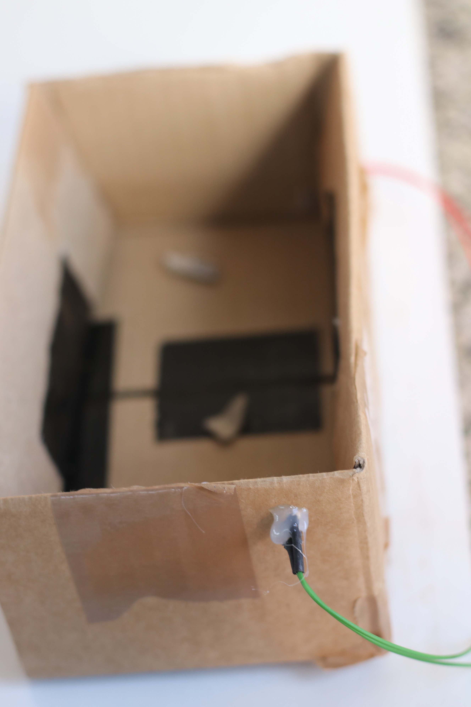

*Ένας από τους δύο αισθητήρες φωτός-φωτοαντιστάσεις του δοχείου τροφής*

Στην αποθήκη της τροφής κατασκευάστηκε μια ηλεκτρονικά ελεγχόμενη καταπακτή για τον έλεγχο της παροχής της τροφής. Για τη σωστή πλήρωση του δοχείου της τροφής, από όπου θα ταΐζεται το ζώο, έχουν τοποθετηθεί δύο αισθητήρες φωτός. Ένας στο άνω μέρος του δοχείου για να αντιλαμβάνεται πότε το δοχείο είναι γεμάτο με τροφή και ένας στο κάτω μέρος του δοχείου για να αντιλαμβάνεται πότε το δοχείο είναι άδειο.
#### Μηχανισμός παροχής νερού ####
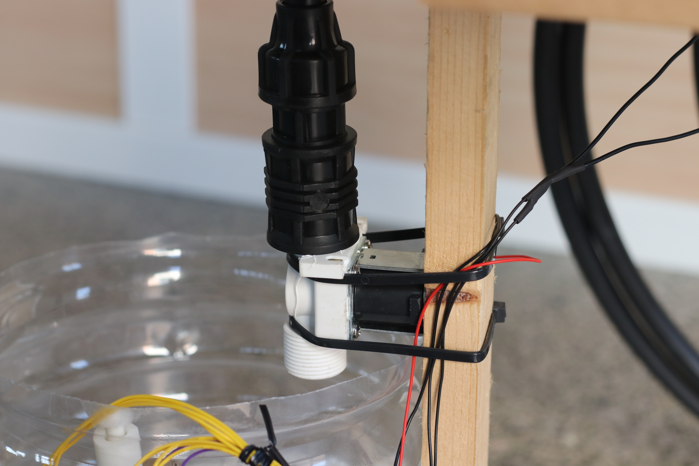

*Hλεκτροβαλβίδα για τον έλεγχο της ροής του νερού.*

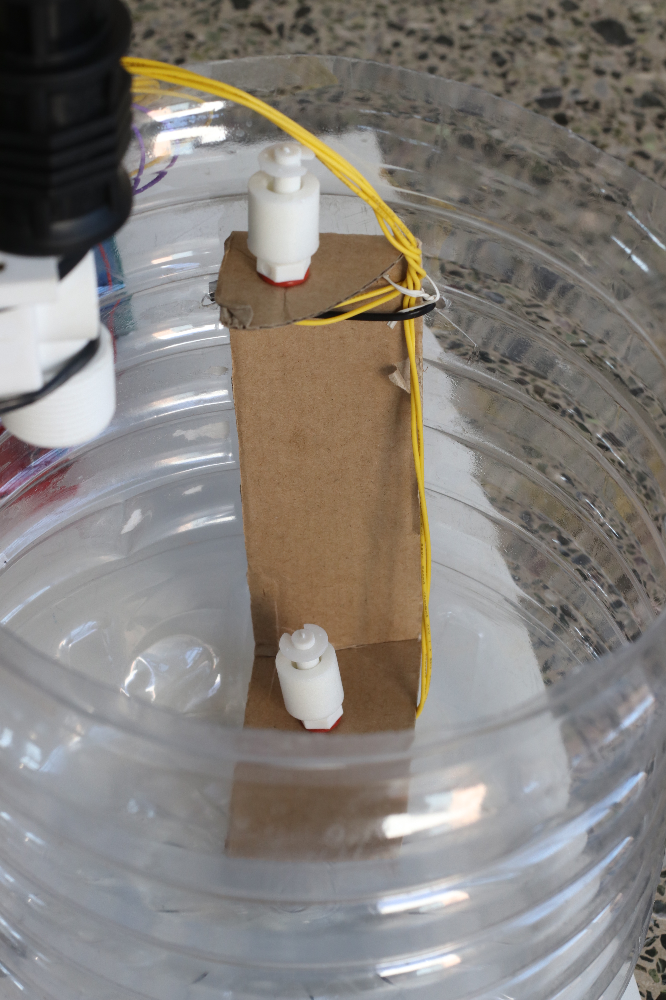

*Αισθητήρες στάθμης τοποθετημένοι στο δοχείο νερού*

Για τον έλεγχο της ροής του νερού χρησιμοποιείται μια ηλεκτροβαλβίδα στο τέλος ενός κατάλληλα διαμορφωμένου λάστιχου ύδρευσης. Το λάστιχο καταλήγει σε ένα δοχείο νερού, εφοδιασμένο με δύο αισθητήρες ελέγχου στάθμης. Για τη σωστή πλήρωση του δοχείου νερού, από όπου θα ποτίζεται το ζώο, έχουν τοποθετηθεί ο ένας στο άνω μέρος του δοχείου για να αντιλαμβάνεται πότε το δοχείο είναι γεμάτο με νερό και ο άλλος στο κάτω μέρος του δοχείου για να αντιλαμβάνεται πότε το δοχείο είναι άδειο.

# Εκπαιδευτικό υλικό/περιεχόμενο/παρουσίαση #
## Αποθετήριο στο github ##
Για την υποστήριξη της εργασίας δημιουργήθηκε ένα αποθετήριο στο github, στην παρακάτω διεύθυνση:
- [https://github.com/2o-gymnasio-chania/2021_openedtech_competition](https://github.com/2o-gymnasio-chania/2021_openedtech_competition)

Το αποθετήριο περιλαμβάνει την πλήρη περιγραφή του ρομπότ, το πρόγραμμα του και όλο το συνοδευτικό υλικό από τη διαδικασία της σχεδίασης και της κατασκευής.

## Ιστοσελίδα στο robotics.ellak και φωτογραφίες ##
Για την υποστήριξη της εργασίας δημιουργήθηκε η παρακάτω ιστοσελίδα στο robotics.ellak:
- [https://openedtech.ellak.gr/?post_type=robotics2021&p=6217&preview=true](https://openedtech.ellak.gr/?post_type=robotics2021&p=6217&preview=true)

Στην ιστοσελίδα υπάρχει μια σύντομη παρουσίαση με σχέδια και φωτογραφίες από τη διαδικασία σχεδίασης και κατασκευής του ρομπότ.

## Σχέδια μαθήματος/Παραγωγή ενός σχέδιο ανοιχτού εκπαιδευτικού πόρου σύμφωνα με το OER ##

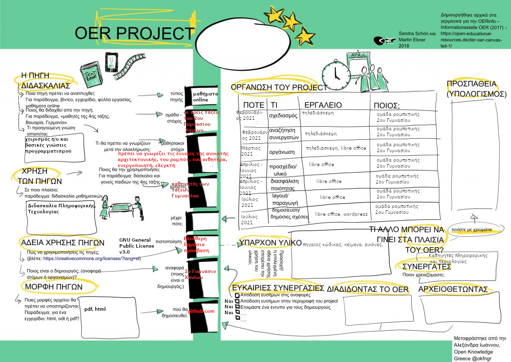

*Σχέδιο ανοιχτού εκπαιδευτικού πόρου σύμφωνα με το OER*

Στο πλαίσιο του διαγωνισμού αναπτύχθηκε ένα [σχέδιο ανοιχτού εκπαιδευτικού πόρου](https://oer.ellak.gr/2018/03/02/oer-canvas-to-protipo-gia-tin-dimiourgia-anichton-ekpedeftikon-poron-ke-sta-ellinika/) - Open Educational Resources (OER). Το σχέδιo είναι διαθέσιμο στο αποθετήριο της ομάδας:
- [https://github.com/2o-gymnasio-chania/2021_openedtech_competition/blob/main/OER_canvas/OER_canvas_feedBot.png](https://github.com/2o-gymnasio-chania/2021_openedtech_competition/blob/main/OER_canvas/OER_canvas_feedBot.png)

## Άδειες χρήσης, για άδειες λογισμικού και περιεχομένου ##
Η άδεια χρήση που επιλέχθηκε για το έργο της ομάδας είναι η [GNU General Public License v3.0](https://github.com/2o-gymnasio-chania/2021_openedtech_competition/blob/main/LICENSE).

